#  House Price Prediction


> Predicting residential house prices from the Ames Housing Dataset using Multiple Linear Regression.

---

##  Table of Contents

- [Project Overview](#-project-overview)
- [Dataset](#-dataset)
- [Project Workflow](#-project-workflow)
- [Technologies Used](#-technologies-used)
- [Model Performance](#-model-performance)
- [Results](#-results)
- [Project Structure](#-project-structure)
- [How to Run](#-how-to-run)
- [Future Improvements](#-future-improvements)
- [Author](#-author)

---

##  Project Overview

This project demonstrates the complete workflow of building a **Multiple Linear Regression** model to predict house prices from structural and neighborhood features.

The pipeline covers the full modeling lifecycle:

-  Data preprocessing
-  Data validation
-  Handling missing values
-  Feature selection
- 🔢 One-Hot Encoding
- ✂️ Train/Test split
- 🧠 Model training
- 🔮 Prediction
- 📏 Model evaluation

---

## 📊 Dataset

**Dataset:** Ames Housing Dataset

The dataset contains detailed information about residential properties in Ames, Iowa, combining both **numerical** features (e.g., square footage, number of rooms) and **categorical** features (e.g., neighborhood, building type).

**Target Variable:** `SalePrice`

---

## 🔄 Project Workflow

```mermaid
flowchart LR
    A[Import Libraries] --> B[Load Dataset]
    B --> C[Data Validation]
    C --> D[Handle Missing Values]
    D --> E[Feature Selection]
    E --> F[One-Hot Encoding]
    F --> G[Train/Test Split]
    G --> H[Train Regression Model]
    H --> I[Predict House Prices]
    I --> J[Evaluate Model]
```



1. Import Libraries
2. Load Dataset
3. Data Validation
4. Handle Missing Values
5. Feature Selection
6. One-Hot Encoding
7. Split Data into Training and Testing Sets
8. Train Multiple Linear Regression Model
9. Predict House Prices
10. Evaluate the Model

---

## 🛠️ Technologies Used

| Category | Tools |
|---|---|
| Language | Python |
| Numerical Computing | NumPy |
| Data Handling | Pandas |
| Visualization | Matplotlib |
| Machine Learning | Scikit-learn |

---

## 📏 Model Performance

| Metric | Value | What It Means |
|---|---:|---|
| **R² Score** | 0.741 | The model explains ~74% of the variance in house prices |
| **MAE** | 29,405.02 | On average, predictions are off by ~$29.4K |
| **MSE** | 1,606,427,201.95 | Average squared prediction error (penalizes large errors) |
| **RMSE** | 40,080.26 | Typical prediction error, in the same units as price (~$40K) |

---

## ✅ Results

The Multiple Linear Regression model successfully learned the relationship between housing features and sale prices.

After preprocessing the data and training the model, it achieved an **R² Score of approximately 0.74** on unseen test data — indicating that the model captures the majority of the price variation using the available features, with room for improvement through more advanced techniques.

---

## 📁 Project Structure

```
house-price-prediction/
│
├── data/
│   └── ames_housing.csv
├── notebooks/
│   └── house_price_prediction.ipynb
├── README.md
└── requirements.txt
```

---

## ▶️ How to Run

```bash
# 1. Clone the repository
git clone https://github.com/khaled-amireh/house-price-prediction.git
cd house-price-prediction

# 2. Install dependencies
pip install -r requirements.txt

# 3. Launch the notebook
jupyter notebook notebooks/house_price_prediction.ipynb
```

---

## 🚀 Future Improvements

- Experiment with regularized models (Ridge, Lasso) to reduce overfitting
- Try tree-based models (Random Forest, XGBoost) for potentially higher accuracy
- Perform more advanced feature engineering (interaction terms, polynomial features)
- Apply cross-validation for a more robust performance estimate
- Tune hyperparameters systematically with grid/random search

---

## 👤 Author

**Khaled Amireh**
AI Student | Machine Learning
[GitHub](https://github.com/khaled-amireh)
